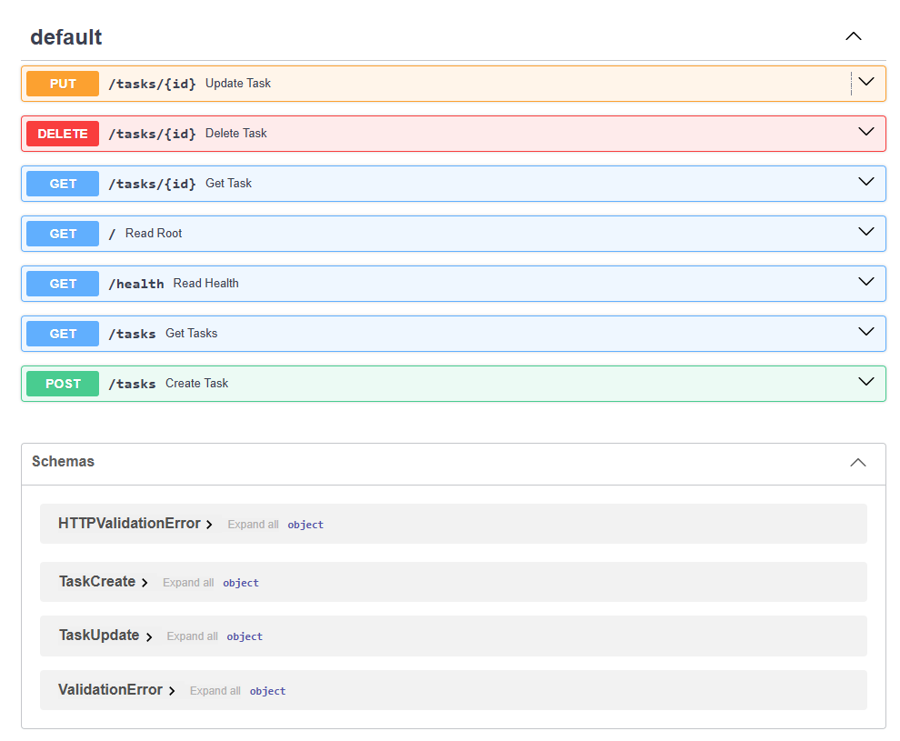
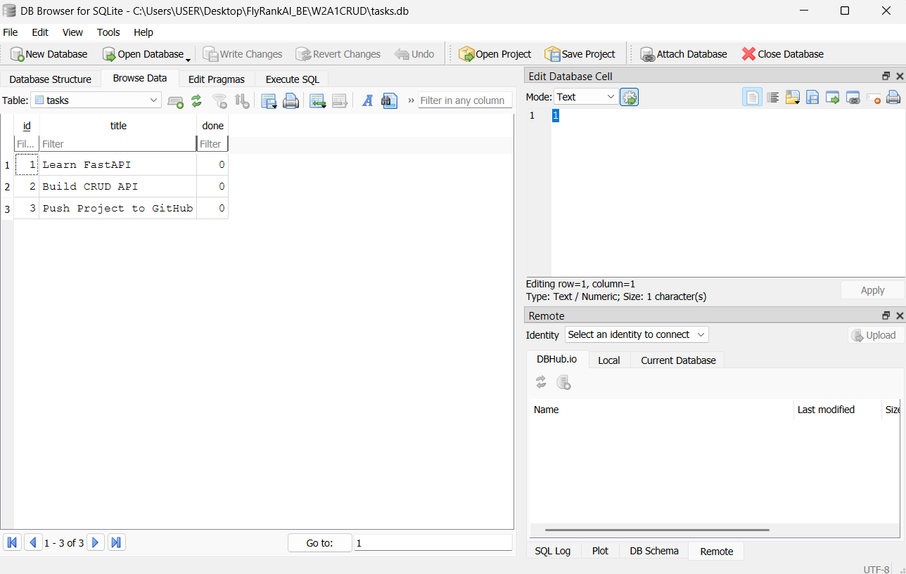

# Task API

A simple RESTful CRUD API built with **FastAPI** and **SQLite** as part of the FlyRank AI Backend Engineer internship task.

The API manages tasks with three fields:

* `id` — unique task ID
* `title` — task title
* `done` — completion status

SQLite is used as the persistent data store, so tasks survive API restarts.

## Features

* Create tasks
* List all tasks
* Get a single task
* Update a task
* Delete a task
* Input validation
* Proper HTTP status codes
* SQLite persistence
* Automatic database and table creation
* Three seed tasks on a fresh database
* Interactive Swagger UI documentation

## Tech Stack

* Python
* FastAPI
* Uvicorn
* Pydantic
* SQLite
* REST API
* Swagger UI / OpenAPI

## Why SQLite?

SQLite was chosen because it provides a simple persistent database without requiring a separate database server.

* The database is stored in a single file.
* It requires zero database-server setup.
* Data survives API restarts.
* It is easy to inspect directly using DB Browser for SQLite.
* A fresh clone can automatically create its database and seed data.

## Database

The SQLite database file is:

```text
tasks.db
```

The file is created automatically when the application starts.

The database contains a `tasks` table with:

| Column  | Type    | Description                    |
| ------- | ------- | ------------------------------ |
| `id`    | INTEGER | Primary key                    |
| `title` | TEXT    | Task title                     |
| `done`  | INTEGER | Completion status (`0` or `1`) |

`tasks.db` is included in `.gitignore`, so it is not committed to GitHub. Each fresh clone creates its own database automatically.

On a new database, the application creates these three seed tasks:

| ID | Title                  | Done  |
| -- | ---------------------- | ----- |
| 1  | Learn FastAPI          | false |
| 2  | Build CRUD API         | false |
| 3  | Push Project to GitHub | false |

## Installation & Run

Clone the repository:

```bash
git clone https://github.com/KashifAli-IT/W2A1CRUD.git
cd W2A1CRUD
```

Create and activate a virtual environment:

### Windows PowerShell

```powershell
python -m venv .venv
.\.venv\Scripts\Activate.ps1
```

Install dependencies:

```powershell
pip install -r requirements.txt
```

Start the API with one command:

```powershell
uvicorn main:app --reload
```

The API will be available at:

```text
http://localhost:8000
```

The database is created automatically when the application starts. No manual database setup is required.

## Clean Start Verification

The project was tested from a clean database state by deleting `tasks.db` and restarting the application.

The database was recreated automatically, the `tasks` table was created, and the three seed tasks were inserted.

Example:

```text
HTTP/1.1 200 OK
content-type: application/json

[{"id":1,"title":"Learn FastAPI","done":false},{"id":2,"title":"Build CRUD API","done":false},{"id":3,"title":"Push Project to GitHub","done":false}]
```

This confirms that a fresh clone can start the application without manually creating the database.

## Swagger UI

Interactive API documentation is available at:

```text
http://localhost:8000/docs
```



## Database in DB Browser for SQLite

The SQLite database can be opened directly with DB Browser for SQLite.



## Stage 4: SQLite Exploration

I explored the SQLite database directly using DB Browser for SQLite and verified that the API and database use the same source of truth.

Example SQL query:

```sql
UPDATE tasks SET done = 1;
```

This query marked all existing tasks as completed in SQLite, and the change appeared immediately through `GET /tasks` without restarting the API.

I also used:

```sql
SELECT * FROM tasks;
```

to inspect all tasks stored in the database.

## API Endpoints

| Method | Endpoint      | Description             | Success |
| ------ | ------------- | ----------------------- | ------- |
| GET    | `/`           | Returns API information | 200     |
| GET    | `/health`     | Checks API health       | 200     |
| GET    | `/tasks`      | Returns all tasks       | 200     |
| GET    | `/tasks/{id}` | Returns one task        | 200     |
| POST   | `/tasks`      | Creates a new task      | 201     |
| PUT    | `/tasks/{id}` | Updates a task          | 200     |
| DELETE | `/tasks/{id}` | Deletes a task          | 204     |

### Error Responses

| Status | Meaning                     |
| ------ | --------------------------- |
| 400    | Invalid or empty request    |
| 404    | Task not found              |
| 422    | Invalid request format/type |

## Example

Create a task:

```bash
curl -i -X POST http://localhost:8000/tasks -H "Content-Type: application/json" -d "{\"title\":\"Buy milk\"}"
```

Example response:

```text
HTTP/1.1 201 Created
content-type: application/json

{
  "id": 4,
  "title": "Buy milk",
  "done": false
}
```

## CRUD Flow

```text
POST   /tasks       → Create
GET    /tasks       → Read all
GET    /tasks/{id}  → Read one
PUT    /tasks/{id}  → Update
DELETE /tasks/{id}  → Delete
```

## Project Structure

```text
W2A1CRUD/
├── .gitignore
├── database.py
├── main.py
├── requirements.txt
├── README.md
└── docs/
    ├── swagger-ui.png
    └── db-browser.png
```

The `tasks.db` file is generated automatically at runtime and is intentionally excluded from Git.

## Author

**Kashif Ali**

GitHub: https://github.com/KashifAli-IT
